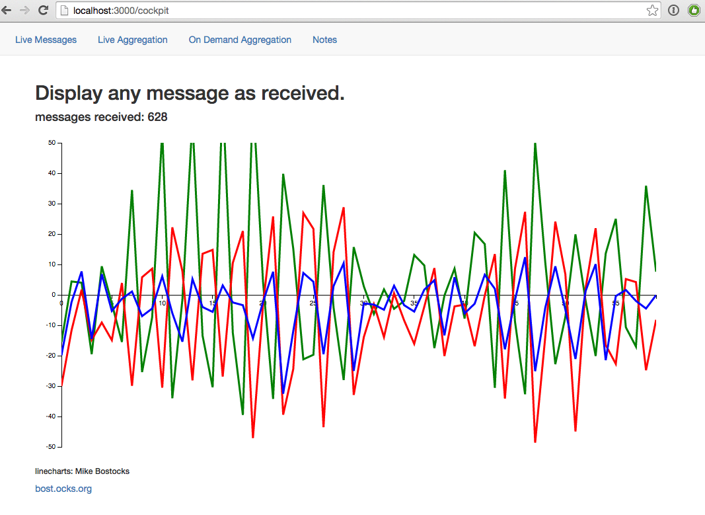

# README #

Have some fun with live data visualisation and mongoDB!

In this demo we collect accelerometer data from smartphones and visualize them live in the browser.
Also the data is saved to mongoDB and we have some short and long(er) term live aggregation examples prepared.
This is meant to be an entertaining talk showing emphasizing on the easiness of making something out of live data.
All you need is included, you can run this on a MacBook wired to a projector.

Yes, the data we collect is useless (privacy)
we just want to have something moving.

You need:
* mongoDB installed
* nodeJS installed
* WIFI
* some smartphone(s)

set up (on a Mac OS X / *nix system):
install the some extra stuff via node's npm:

```
npm i
```

create & start a local mongodb instance, the data folder will be created inside mongodb, make sure port 27017 is not taken already

```
sh mongodb/startDatabase.sh
```

open index.js
and adjust the config if needed

```
config = {
    domain: "localhost", // host your mongodb is running on
    database: "iot_data", // mongodb database name
    mqtthost: "localhost" // optional host your mqtt host is running on
};
```

run the webserver
```
node index.js
```

## Collect accelerometer data ##
make your users go to
* http://<IP YOUR NODE SERVER IS RUNNING ON>:3000/ page -> send accelerometer data to node


## visualization of collected data in your local browser ##
* http://localhost:3000/cockpit -> show live stream data
* http://localhost:3000/cockpit-aggregated -> show aggregated data


originally created for our Mannheim mongoDB MUG
http://www.meetup.com/Mannheim-MongoDB-User-Group/events/218857345/




